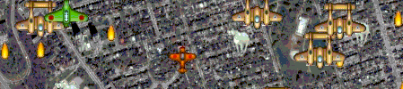

# TOBam

Forward scrolling arcade shooter based in Toronto.

## Description

A simple forward scrolling arcade shooter created in three days as an entry for
the [2007 TOJam](http://www.tojam.ca/games_2007/default.asp).  You fly your
ship through Toronto, defending it from the evil enemy planes. This game was
created using [Microsoft XNA](https://en.wikipedia.org/wiki/Microsoft_XNA) and
[C#](https://en.wikipedia.org/wiki/C_Sharp_(programming_language)), for Windows
and Xbox 360.

## Features

* 1-4 Players
* 3 Levels
* Multiple enemy types
* Powerups
* Top Highscore
* Keyboard or Gamepad controls
* Xbox 360 and Windows support

## Gameplay

Fly your plane around using the left thumbstick on your controller or the arrow
keys. Shoot with the right throttle or the space bar. Your friends can join in
by pressing the start button!

## Requirements

* Microsoft .NET Framework 2.0
* Microsoft XNA Framework 1.0 Refresh

## Credits

Programming: Rob Loach (http://www.robloach.net)
Music: Anthony Garin
Graphics: Ari Feldman (http://www.flyingyogi.com)

## Changelog

* 1.0: May 19, 2007
  * First release

## License

> TOBam - Forward scrolling arcade shooter based in Toronto
>
> Copyright (C) 2007 Rob Loach
>
> This program is free software; you can redistribute it and/or modify
> it under the terms of the GNU General Public License as published by
> the Free Software Foundation; either version 1, or (at your option)
> any later version.
>
> This program is distributed in the hope that it will be useful,
> but WITHOUT ANY WARRANTY; without even the implied warranty of
> MERCHANTABILITY or FITNESS FOR A PARTICULAR PURPOSE.  See the
> GNU General Public License for more details.
>
> You should have received a copy of the GNU General Public License
> along with this program; if not, write to the Free Software
> Foundation, Inc., 675 Mass Ave, Cambridge, MA 02139, USA.
